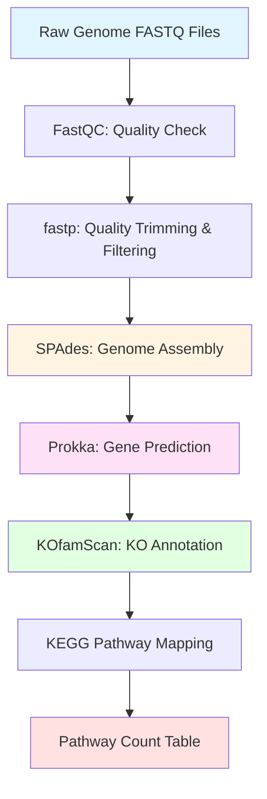

# 🧬 Metabolic Pathway & Enzyme Annotation Pipeline

## 📋 Table of Contents
- [Project Overview](#project-overview)
- [What This Pipeline Does](#what-this-pipeline-does)
- [Workflow Diagram](#workflow-diagram)
- [Installation Requirements](#installation-requirements)
- [Folder Structure](#folder-structure)
- [Running the Pipeline](#running-the-pipeline)
- [Understanding KO Annotation](#understanding-ko-annotation)
- [How KO-to-Pathway Mapping Works](#how-ko-to-pathway-mapping-works)
- [Output Files](#output-files)
- [Biological Interpretation](#biological-interpretation)
- [Troubleshooting](#troubleshooting)

---

## 🌍 Project Overview

This pipeline analyzes bacterial or archaeal genomes downloaded from **ODOG (Online Database of Organisms' Genomes)** to understand their metabolic capabilities.

### Key Questions Answered:
- ✅ Which metabolic pathways does this genome contain?
- ✅ How many genes participate in each pathway?
- ✅ What enzymes (KO IDs) are present?
- ✅ What can this organism do metabolically?
- ✅ Which pathways are complete vs. partial?

---

## 🔬 What This Pipeline Does

### Complete Workflow:
```
Raw Sequencing Reads (FASTQ)
          ↓
    Quality Control (FastQC + fastp)
          ↓
    Genome Assembly (SPAdes)
          ↓
    Gene Prediction (Prokka)
          ↓
    Enzyme Annotation (KOfamScan → KO IDs)
          ↓
    KEGG Pathway Mapping
          ↓
    Pathway Gene Counts & Summary
```

---

## 📊 Workflow Diagram



### Detailed Step-by-Step Process:

#### **Step 1: FastQC** - Quality Assessment
- **Purpose**: Check the quality of raw sequencing reads
- **Input**: Raw FASTQ files (R1 and R2)
- **Output**: HTML quality reports showing:
  - Per-base quality scores
  - GC content distribution
  - Adapter contamination
  - Sequence duplication levels

#### **Step 2: fastp** - Quality Control & Trimming
- **Purpose**: Remove low-quality bases and adapter sequences
- **Actions**:
  - Trim low-quality ends (default quality threshold: Q20)
  - Remove adapter sequences automatically
  - Filter out short reads
  - Generate clean reads for assembly
- **Output**: High-quality trimmed FASTQ files

#### **Step 3: SPAdes** - Genome Assembly
- **Purpose**: Assemble short reads into longer contiguous sequences (contigs)
- **Algorithm**: Uses De Bruijn graph approach
- **Output**: `contigs.fasta` - assembled genome sequences
- **Why Important**: Converts fragmented reads into complete genome sequences

#### **Step 4: Prokka** - Gene Prediction
- **Purpose**: Identify and annotate genes in the assembled genome
- **Process**:
  - Scans contigs for open reading frames (ORFs)
  - Predicts protein-coding genes
  - Assigns basic functional annotations
- **Output**: 
  - `.faa` file - predicted protein sequences
  - `.ffn` file - gene nucleotide sequences
  - `.gff` file - genome annotation in standard format

#### **Step 5: KOfamScan** - Enzyme Annotation
- **Purpose**: Assign KEGG Orthology (KO) identifiers to predicted proteins
- **Method**: Uses Hidden Markov Models (HMMs) to match proteins to known enzyme families
- **Output**: 
  - Table of KO assignments with confidence scores
  - Each protein matched to its best KO hit

#### **Step 6: KEGG Pathway Mapping**
- **Purpose**: Map KO IDs to metabolic pathways
- **Process**:
  - Links each KO to its associated KEGG pathways
  - Counts how many genes from your genome participate in each pathway
- **Output**: 
  - Pathway-wise gene counts
  - Complete metabolic profile

---

## 🛠️ Installation Requirements

### Prerequisites
```bash
# System requirements
- Linux or macOS
- At least 16 GB RAM (32 GB recommended)
- 50 GB free disk space
```

### Required Software

#### 1. Install Conda (if not already installed)
```bash
wget https://repo.anaconda.com/miniconda/Miniconda3-latest-Linux-x86_64.sh
bash Miniconda3-latest-Linux-x86_64.sh
```

#### 2. Create Conda Environment
```bash
conda create -n metabolic_pipeline python=3.8
conda activate metabolic_pipeline
```

#### 3. Install Pipeline Tools
```bash
# FastQC
conda install -c bioconda fastqc

# fastp
conda install -c bioconda fastp

# SPAdes
conda install -c bioconda spades

# Prokka
conda install -c bioconda prokka

# Ruby (required for KOfamScan)
conda install -c conda-forge ruby
gem install parallel
```

#### 4. Install KOfamScan
```bash
cd ~
git clone https://github.com/takaram/kofam_scan.git
cd kofam_scan
chmod +x exec_annotation
```

#### 5. Download KOfamScan Database
```bash
# Create database directory
mkdir -p ~/kofam_db
cd ~/kofam_db

# Download HMM profiles (~2.5 GB)
wget ftp://ftp.genome.jp/pub/db/kofam/profiles.tar.gz
tar -xvzf profiles.tar.gz

# Download KO list
wget ftp://ftp.genome.jp/pub/db/kofam/ko_list.gz
gunzip ko_list.gz
```

#### 6. Download KEGG Mapping Tables
```bash
# Create mapping directory
mkdir -p ~/pathway_mappings
cd ~/pathway_mappings

# Download pathway titles
wget https://rest.kegg.jp/list/pathway -O pathway_titles.tab

# Download KO-to-pathway links
wget https://rest.kegg.jp/link/pathway/ko -O ko_to_pathway.tab
```

---

## 📁 Folder Structure

```
metabolic_pipeline/
│
├── final_run.sh                 # Main pipeline script
├── README.md                    # This file
│
├── kofam/
│   ├── profiles/                # KOfam HMM profiles
│   ├── ko_list                  # KO definitions
│   └── kofam_scan/              # KOfamScan tool
│
├── pathway_mappings/
│   ├── pathway_titles.tab       # Pathway names
│   └── ko_to_pathway.tab        # KO→Pathway links
│
├── data/
│   └── raw/                     # Input FASTQ files
│
├── outputs/
│   ├── qc/                      # FastQC reports
│   ├── assembly/                # SPAdes contigs
│   ├── annotation/              # Prokka results
│   ├── kofam/                   # KOfamScan results
│   └── pathways/                # Final pathway tables
│
└── logs/                        # Pipeline logs
```

---

## 🚀 Running the Pipeline

### Command Syntax
```bash
bash final_run.sh <R1.fastq.gz> <R2.fastq.gz> <sample_name> <kofam_dir> <pathway_mapping_dir>
```

### Example Usage
```bash
bash final_run.sh \
  data/raw/SRR12345_R1.fastq.gz \
  data/raw/SRR12345_R2.fastq.gz \
  my_genome \
  /home/user/kofam_db \
  /home/user/pathway_mappings
```

### Parameters Explained
- `<R1.fastq.gz>`: Forward reads file
- `<R2.fastq.gz>`: Reverse reads file  
- `<sample_name>`: Name for output files (e.g., "ecoli_sample1")
- `<kofam_dir>`: Path to KOfam database directory
- `<pathway_mapping_dir>`: Path to KEGG mapping files

### Expected Runtime
- Small genome (2-5 Mb): 30-60 minutes
- Medium genome (5-10 Mb): 1-3 hours
- Large genome (>10 Mb): 3-6 hours

---

## 🧬 Understanding KO Annotation

### What is a KO ID?

**KO = KEGG Orthology**

A KO is a unique identifier for a gene/protein with a specific enzymatic or biological function.

#### Example KO Entries:
| KO ID | Enzyme Name | Function |
|-------|-------------|----------|
| K00845 | glucokinase | Phosphorylates glucose in glycolysis |
| K01810 | glucose-6-phosphate isomerase | Converts G6P to F6P in glycolysis |
| K00134 | glyceraldehyde-3-phosphate dehydrogenase | Key enzyme in glycolysis |
| K01647 | citrate synthase | First step of TCA cycle |

### How KOfamScan Works

```
Your Protein Sequence
        ↓
Compare to 20,000+ HMM Profiles
        ↓
Find Best Match Above Threshold
        ↓
Assign KO ID
```

#### Scoring System:
- **E-value < 0.00001**: High confidence match
- **Score > Threshold**: Significant hit
- **Coverage > 50%**: Good alignment

### KOfamScan Output Example

```
# gene_name  KO         score    E-value   description
PROKKA_00001 K00845     250.3    1.2e-75   glucokinase
PROKKA_00002 K01810     189.7    3.4e-57   glucose-6-phosphate isomerase
PROKKA_00003 K00134     312.4    5.6e-94   GAPDH
```

---

## 🗺️ How KO-to-Pathway Mapping Works

### Step-by-Step Process

#### Step 1: KO Assignment
After Prokka predicts genes, KOfamScan assigns KO IDs:
```
Gene_001 → K00845 (glucokinase)
Gene_002 → K01810 (glucose-6-phosphate isomerase)  
Gene_003 → K00134 (GAPDH)
```

#### Step 2: KO-to-Pathway Linking
Each KO belongs to one or more KEGG pathways:
```
K00845 → map00010 (Glycolysis / Gluconeogenesis)
K01810 → map00010 (Glycolysis / Gluconeogenesis)
K00134 → map00010 (Glycolysis / Gluconeogenesis)
K00134 → map00710 (Carbon fixation)
```

#### Step 3: Pathway Counting
Count unique genes per pathway:
```
map00010 (Glycolysis): 3 genes
map00710 (Carbon fixation): 1 gene
```

### Mapping Table Structure

**ko_to_pathway.tab** format:
```
ko:K00845    path:map00010
ko:K00845    path:map00051
ko:K01810    path:map00010
ko:K01810    path:map00520
```

**pathway_titles.tab** format:
```
path:map00010    Glycolysis / Gluconeogenesis
path:map00020    Citrate cycle (TCA cycle)
path:map00030    Pentose phosphate pathway
```

### Visual Representation

```
┌─────────────────────────────────────────────────┐
│         Your Genome (1000 genes)                │
└───────────────────┬─────────────────────────────┘
                    │
                    ↓ Prokka
┌─────────────────────────────────────────────────┐
│      Predicted Proteins (950 proteins)          │
└───────────────────┬─────────────────────────────┘
                    │
                    ↓ KOfamScan
┌─────────────────────────────────────────────────┐
│    KO Assignments (600 proteins with KOs)       │
│    K00845, K01810, K00134, K01647...            │
└───────────────────┬─────────────────────────────┘
                    │
                    ↓ KEGG Mapping
┌─────────────────────────────────────────────────┐
│           Pathway Distribution                  │
│  • Glycolysis: 18 genes                        │
│  • TCA Cycle: 14 genes                         │
│  • Amino Acid Biosynthesis: 35 genes           │
│  • Fatty Acid Metabolism: 22 genes             │
└─────────────────────────────────────────────────┘
```

---

## 📦 Output Files

### Main Output Files

| File | Description | Format |
|------|-------------|--------|
| `contigs.fasta` | Assembled genome sequences | FASTA |
| `{sample}.faa` | Predicted protein sequences | FASTA |
| `{sample}.gff` | Genome annotation | GFF3 |
| `{sample}_kegg.tsv` | All KO assignments | TSV |
| `{sample}_kegg_filtered.tsv` | High-confidence KO hits | TSV |
| `KO_list.txt` | Unique KO IDs found | Text |
| `ko_pathway_final.tsv` | KO→Pathway mapping | TSV |
| `pathway_counts.tsv` | Gene counts per pathway | TSV |
| `logfile.txt` | Pipeline execution log | Text |

### Key Output: pathway_counts.tsv

Example output:
```
Pathway_ID    Pathway_Name                           Gene_Count
map00010      Glycolysis / Gluconeogenesis          18
map00020      Citrate cycle (TCA cycle)             14
map00030      Pentose phosphate pathway             9
map00190      Oxidative phosphorylation             25
map00220      Arginine biosynthesis                 12
map00230      Purine metabolism                     31
map00240      Pyrimidine metabolism                 27
map00250      Alanine, aspartate & glutamate met.   15
map00290      Valine, leucine & isoleucine biosynth 11
map00350      Tyrosine metabolism                   8
```

### Interpreting the Results

#### High Gene Count = Well-Represented Pathway
- **Oxidative phosphorylation (25 genes)**: This organism likely performs aerobic respiration
- **Amino acid biosynthesis pathways (many genes)**: Can synthesize its own amino acids

#### Low Gene Count = Partial Pathway
- **Tyrosine metabolism (8 genes)**: May have incomplete pathway; organism might require dietary tyrosine

#### Zero Genes = Absent Pathway
- If **map00910 (Nitrogen metabolism)** has 0 genes, organism cannot fix nitrogen

---

## 🔍 Biological Interpretation

### What Can You Learn?

#### 1. **Metabolic Capabilities**
Identify what the organism can produce or break down:
- ✅ **Glycolysis present** → Can metabolize glucose
- ✅ **TCA cycle present** → Can perform aerobic respiration
- ✅ **Fatty acid biosynthesis** → Can make its own lipids
- ❌ **Nitrogen fixation absent** → Cannot fix atmospheric nitrogen

#### 2. **Ecological Role**
Understand the organism's lifestyle:
- **High oxidative phosphorylation genes** → Aerobic organism
- **Fermentation pathways** → Can survive without oxygen
- **Photosynthesis genes** → Photoautotroph
- **Sulfur metabolism** → May live in sulfur-rich environments

#### 3. **Nutritional Requirements**
Determine what nutrients are needed:
- **Complete amino acid biosynthesis** → Can grow on minimal media
- **Missing vitamin biosynthesis** → Requires vitamin supplementation
- **Incomplete nucleotide synthesis** → Needs nucleotide sources

#### 4. **Biotechnology Potential**
Assess industrial applications:
- **Secondary metabolite pathways** → May produce antibiotics or bioactive compounds
- **Lipid metabolism enzymes** → Potential for biofuel production
- **Degradation pathways** → Could be used for bioremediation

### Example Interpretation

```
Organism: Marine bacterium from deep-sea vent

Key Findings:
✅ Oxidative phosphorylation: 28 genes → Aerobic respiration
✅ Nitrogen metabolism: 15 genes → Can utilize nitrate/nitrite
✅ Sulfur metabolism: 22 genes → Adapted to sulfur-rich environment
✅ Amino acid biosynthesis: 89 genes → Nutritionally independent
❌ Photosynthesis: 0 genes → Chemotroph (not photosynthetic)
❌ Flagellar assembly: 3 genes (incomplete) → Likely non-motile

Conclusion: This is a non-motile, aerobic chemotroph adapted 
to deep-sea sulfur-rich environments. It can synthesize most 
nutrients internally and likely plays a role in sulfur cycling.
```

---

## 🎓 Understanding Each Tool in Detail

### FastQC - Quality Assessment
- **What it does**: Generates quality reports for raw sequencing data
- **Key metrics**:
  - **Per-base quality**: Should be >Q30 for most bases
  - **GC content**: Should match expected organism GC%
  - **Adapter content**: Should be low (<5%)
- **Red flags**: 
  - Low quality scores at read ends
  - Unusual GC distribution
  - High duplication rates

### fastp - Read Trimming
- **What it does**: Cleans up sequencing reads
- **Actions performed**:
  - Removes adapter sequences
  - Trims low-quality ends (default Q20)
  - Filters short reads (<50 bp)
  - Removes reads with too many Ns
- **Output**: Clean, high-quality reads ready for assembly

### SPAdes - Genome Assembly
- **What it does**: Assembles short reads into longer contigs
- **Algorithm**: De Bruijn graph assembly
- **Key parameters**:
  - Multiple k-mer sizes (21, 33, 55, 77)
  - Error correction module
  - Careful mode for bacterial genomes
- **Quality metrics**:
  - **N50**: Half of assembly in contigs this size or larger
  - **L50**: Number of contigs comprising 50% of assembly
  - **Total length**: Should match expected genome size

### Prokka - Gene Prediction
- **What it does**: Finds and annotates genes
- **Process**:
  1. Predicts tRNA genes (tRNAscan-SE)
  2. Predicts rRNA genes (Barrnap)
  3. Predicts protein-coding genes (Prodigal)
  4. Annotates functions (BLAST against databases)
- **Outputs**:
  - `.faa`: Protein sequences
  - `.ffn`: Gene nucleotide sequences
  - `.gff`: Genome annotation
  - `.gbk`: GenBank format

### KOfamScan - Enzyme Annotation
- **What it does**: Assigns KO IDs using HMM profiles
- **Method**:
  - Uses 20,000+ HMM profiles from KEGG
  - Scores each protein against all profiles
  - Assigns best match above threshold
- **Confidence scoring**:
  - **Score**: Higher = better match
  - **E-value**: Lower = more significant
  - **Threshold**: Predefined cutoff per KO

---

## 🐛 Troubleshooting

### Common Issues

#### Issue 1: KOfamScan Fails
```bash
Error: exec_annotation not found
```
**Solution**: Ensure KOfamScan is executable
```bash
cd ~/kofam_scan
chmod +x exec_annotation
```

#### Issue 2: Assembly Quality Poor
```bash
Warning: N50 < 10,000 bp
```
**Solution**: 
- Check read quality with FastQC
- Increase sequencing depth
- Try different k-mer sizes in SPAdes

#### Issue 3: Low KO Assignment Rate
```bash
Only 30% of proteins assigned KO IDs
```
**Solution**: This is normal! Not all proteins have known KO assignments
- Check E-value threshold (try relaxing to 1e-5)
- Verify HMM database is complete

#### Issue 4: KEGG Mapping Files Not Found
```bash
Error: pathway_titles.tab not found
```
**Solution**: Re-download mapping files
```bash
cd ~/pathway_mappings
wget https://rest.kegg.jp/list/pathway -O pathway_titles.tab
wget https://rest.kegg.jp/link/pathway/ko -O ko_to_pathway.tab
```

#### Issue 5: Out of Memory
```bash
SPAdes error: not enough memory
```
**Solution**: 
- Reduce k-mer size range
- Subsample reads (downsample to 50x coverage)
- Use computing cluster with more RAM

---

## 📚 Additional Resources

### KEGG Database
- **Main site**: https://www.kegg.jp/
- **Pathway maps**: https://www.kegg.jp/kegg/pathway.html
- **KO database**: https://www.kegg.jp/kegg/ko.html

### Tool Documentation
- **FastQC**: https://www.bioinformatics.babraham.ac.uk/projects/fastqc/
- **fastp**: https://github.com/OpenGene/fastp
- **SPAdes**: https://cab.spbu.ru/software/spades/
- **Prokka**: https://github.com/tseemann/prokka
- **KOfamScan**: https://github.com/takaram/kofam_scan

### Further Reading
- **Genomic annotation workflows**: Nature Protocols
- **KEGG pathway analysis**: Nucleic Acids Research
- **Metabolic reconstruction**: PLoS Computational Biology

---

## 👥 Credits & Citation

**Developed by**: Group 2 - MSc Bioinformatics

**Tools Used**:
- FastQC (Andrews, 2010)
- fastp (Chen et al., 2018)
- SPAdes (Bankevich et al., 2012)
- Prokka (Seemann, 2014)
- KOfamScan (Aramaki et al., 2020)
- KEGG Database (Kanehisa et al., 2023)

---

## 📝 License

This pipeline is released under the MIT License. Feel free to use, modify, and distribute.

---

## 📧 Contact & Support

For questions or issues, please:
- Open an issue on GitHub
- Contact: your.email@university.edu
- Lab website: https://your-lab-website.edu

---

**Last Updated**: November 2025  
**Pipeline Version**: 1.0  
**Compatible with**: Bacterial and Archaeal genomes
