```mermaid
graph TB
    A[📁 Raw FASTQ Reads<br/>] --> B[🔍 FastQC<br/>Quality Assessment]
    B --> C[✂️ fastp<br/>Quality Trimming & Filtering]
    C --> D[🧩 SPAdes<br/>Genome Assembly]
    D --> E[🔬 Prokka<br/>Gene Prediction]
    E --> F[🧬 KOfamScan<br/>KO Annotation]
    F --> G[🗺️ KEGG Mapping<br/>Pathway Analysis]
    G --> H[📊 pathway_counts.tsv<br/>Final Results]
    
    style A fill:#e3f2fd,stroke:#1976d2,stroke-width:3px,color:#000
    style B fill:#fff3e0,stroke:#f57c00,stroke-width:3px,color:#000
    style C fill:#f3e5f5,stroke:#7b1fa2,stroke-width:3px,color:#000
    style D fill:#e8f5e9,stroke:#388e3c,stroke-width:3px,color:#000
    style E fill:#fce4ec,stroke:#c2185b,stroke-width:3px,color:#000
    style F fill:#e0f2f1,stroke:#00796b,stroke-width:3px,color:#000
    style G fill:#fff9c4,stroke:#f9a825,stroke-width:3px,color:#000
    style H fill:#ffebee,stroke:#c62828,stroke-width:3px,color:#000
```

```mermaid
graph TD
    A[📝 STEP 1: KO Assignment<br/>────────────────────<br/>Gene_001 → K00845<br/>Gene_002 → K01810<br/>Gene_003 → K00134] --> B[🔗 STEP 2: Link to Pathways<br/>────────────────────<br/>K00845 → map00010<br/>K01810 → map00010<br/>K00134 → map00010, map00710]
    B --> C[📊 STEP 3: Count Genes<br/>────────────────────<br/>map00010: 3 genes<br/>map00710: 1 gene]
    
    style A fill:#e1f5fe,stroke:#01579b,stroke-width:4px,color:#000,font-size:14px
    style B fill:#f3e5f5,stroke:#4a148c,stroke-width:4px,color:#000,font-size:14px
    style C fill:#e8f5e9,stroke:#1b5e20,stroke-width:4px,color:#000,font-size:14px
```

# <div align="center">🧬 Metabolic Pathway & Enzyme Annotation Pipeline</div>

<div align="center">


</div>

<div align="center">
<h3>🔬 Analyze genome metabolic capabilities through automated enzyme annotation and pathway mapping</h3>
</div>

---

## <div align="center">🎯 What This Pipeline Does</div>

<div style="font-size: 16px;">

Transforms **raw genome sequences** into **comprehensive metabolic profiles** by identifying genes, annotating enzymes, and mapping them to KEGG pathways.

</div>

### <div align="center">**Key Questions Answered**</div>

<table align="center" style="font-size: 15px;">
<tr>
<td>✅ Which metabolic pathways exist in the genome?</td>
</tr>
<tr>
<td>✅ How many genes participate in each pathway?</td>
</tr>
<tr>
<td>✅ What are the organism's metabolic capabilities?</td>
</tr>
<tr>
<td>✅ Which pathways are complete vs. incomplete?</td>
</tr>
</table>

---

## <div align="center">📊 Pipeline Workflow Visualization</div>

<div align="center">



</div>

---

### <div align="center">📋 Detailed Step-by-Step Process</div>

<table style="font-size: 15px; width: 100%;">
<thead>
<tr style="background-color: #f0f0f0;">
<th style="padding: 12px;">Step</th>
<th style="padding: 12px;">Tool</th>
<th style="padding: 12px;">Function</th>
<th style="padding: 12px;">Output</th>
</tr>
</thead>
<tbody>
<tr>
<td style="padding: 10px;">1️⃣</td>
<td style="padding: 10px;"><strong>FastQC</strong></td>
<td style="padding: 10px;">Quality assessment of raw reads</td>
<td style="padding: 10px;">HTML quality reports</td>
</tr>
<tr style="background-color: #f9f9f9;">
<td style="padding: 10px;">2️⃣</td>
<td style="padding: 10px;"><strong>fastp</strong></td>
<td style="padding: 10px;">Trim & filter low-quality sequences</td>
<td style="padding: 10px;">Clean FASTQ files</td>
</tr>
<tr>
<td style="padding: 10px;">3️⃣</td>
<td style="padding: 10px;"><strong>SPAdes</strong></td>
<td style="padding: 10px;">Assemble reads into contigs</td>
<td style="padding: 10px;">contigs.fasta</td>
</tr>
<tr style="background-color: #f9f9f9;">
<td style="padding: 10px;">4️⃣</td>
<td style="padding: 10px;"><strong>Prokka</strong></td>
<td style="padding: 10px;">Predict genes & proteins</td>
<td style="padding: 10px;">proteins.faa</td>
</tr>
<tr>
<td style="padding: 10px;">5️⃣</td>
<td style="padding: 10px;"><strong>KOfamScan</strong></td>
<td style="padding: 10px;">Annotate enzymes with KO IDs</td>
<td style="padding: 10px;">KO assignments</td>
</tr>
<tr style="background-color: #f9f9f9;">
<td style="padding: 10px;">6️⃣</td>
<td style="padding: 10px;"><strong>KEGG Mapping</strong></td>
<td style="padding: 10px;">Map KOs to metabolic pathways</td>
<td style="padding: 10px;">pathway_counts.tsv</td>
</tr>
</tbody>
</table>

---

## <div align="center">🔧 Quick Installation</div>

<div style="font-size: 15px;">

```bash
# 1️⃣ Create conda environment
conda create -n metabolic_pipeline python=3.8
conda activate metabolic_pipeline

# 2️⃣ Install bioinformatics tools
conda install -c bioconda fastqc fastp spades prokka
conda install -c conda-forge ruby
gem install parallel

# 3️⃣ Install KOfamScan
git clone https://github.com/takaram/kofam_scan.git
cd kofam_scan && chmod +x exec_annotation

# 4️⃣ Download KOfam database (~1.4 GB)
mkdir -p ~/kofam_db && cd ~/kofam_db
wget ftp://ftp.genome.jp/pub/db/kofam/profiles.tar.gz
tar -xvzf profiles.tar.gz
wget ftp://ftp.genome.jp/pub/db/kofam/ko_list.gz
gunzip ko_list.gz

# 5️⃣ Download KEGG mapping files
mkdir -p ~/pathway_mappings && cd ~/pathway_mappings
wget https://rest.kegg.jp/list/pathway -O pathway_titles.tab
wget https://rest.kegg.jp/link/pathway/ko -O ko_to_pathway.tab
```

</div>

---

## <div align="center">🚀 Running the Pipeline</div>

<div style="font-size: 15px;">

### **Command Syntax**

```bash
bash final_run.sh <R1.fastq.gz> <R2.fastq.gz> <sample_name> <kofam_dir> <pathway_dir>
```

### **Example Usage**

```bash
bash final_run.sh \
  SRR12345_R1.fastq.gz \
  SRR12345_R2.fastq.gz \
  my_genome \
  ~/kofam_db \
  ~/pathway_mappings
```

</div>

---

## <div align="center">🧬 Understanding KO Annotation</div>

### <div align="center">**What is a KO ID?**</div>

<div align="center" style="font-size: 16px; padding: 20px; background-color: #f5f5f5; border-radius: 8px; margin: 20px 0;">
<strong>KO (KEGG Orthology)</strong> = Unique identifier for a gene/enzyme function
</div>

<table align="center" style="font-size: 15px; width: 80%;">
<thead>
<tr style="background-color: #2196f3; color: white;">
<th style="padding: 12px;">KO ID</th>
<th style="padding: 12px;">Enzyme Name</th>
<th style="padding: 12px;">Pathway</th>
</tr>
</thead>
<tbody>
<tr>
<td style="padding: 10px;"><code>K00845</code></td>
<td style="padding: 10px;">Glucokinase</td>
<td style="padding: 10px;">Glycolysis</td>
</tr>
<tr style="background-color: #f9f9f9;">
<td style="padding: 10px;"><code>K01647</code></td>
<td style="padding: 10px;">Citrate synthase</td>
<td style="padding: 10px;">TCA Cycle</td>
</tr>
<tr>
<td style="padding: 10px;"><code>K00134</code></td>
<td style="padding: 10px;">GAPDH</td>
<td style="padding: 10px;">Glycolysis</td>
</tr>
<tr style="background-color: #f9f9f9;">
<td style="padding: 10px;"><code>K15780</code></td>
<td style="padding: 10px;">Nitrogenase</td>
<td style="padding: 10px;">Nitrogen Fixation</td>
</tr>
</tbody>
</table>

---

### <div align="center">**KOfamScan Workflow**</div>

<div align="center">



</div>

<div align="center" style="font-size: 15px; margin-top: 20px;">

```mermaid
graph LR
    A[🧪 Predicted Proteins<br/>from Prokka] --> B{🔬 KOfamScan<br/>HMM Matching}
    B --> C[📊 Score Calculation<br/>E-value & Threshold]
    C --> D[✅ KO Assignment<br/>Best Match]
    D --> E[📋 KO List<br/>for Genome]
    
    style A fill:#bbdefb,stroke:#1976d2,stroke-width:3px,color:#000
    style B fill:#c8e6c9,stroke:#388e3c,stroke-width:3px,color:#000
    style C fill:#fff9c4,stroke:#f9a825,stroke-width:3px,color:#000
    style D fill:#f8bbd0,stroke:#c2185b,stroke-width:3px,color:#000
    style E fill:#b2dfdb,stroke:#00796b,stroke-width:3px,color:#000
```

**Matching Process:** Compare against **20,000+ HMM profiles** → Score matches (E-value < 1e-5) → Assign best KO

</div>

---

## <div align="center">🗺️ KO-to-Pathway Mapping</div>

### <div align="center">**3-Step Mapping Process**</div>

<div align="center">



</div>

---

### <div align="center">**Mapping Files Explained**</div>

<table style="font-size: 15px; width: 90%; margin: 20px auto;">
<thead>
<tr style="background-color: #4caf50; color: white;">
<th style="padding: 12px;">File</th>
<th style="padding: 12px;">Content</th>
<th style="padding: 12px;">Example</th>
</tr>
</thead>
<tbody>
<tr>
<td style="padding: 10px;"><strong>ko_to_pathway.tab</strong></td>
<td style="padding: 10px;">Links KO to pathways</td>
<td style="padding: 10px;"><code>ko:K00845 → path:map00010</code></td>
</tr>
<tr style="background-color: #f9f9f9;">
<td style="padding: 10px;"><strong>pathway_titles.tab</strong></td>
<td style="padding: 10px;">Pathway names</td>
<td style="padding: 10px;"><code>path:map00010 → Glycolysis</code></td>
</tr>
</tbody>
</table>

---

## <div align="center">📦 Key Output Files</div>

<table style="font-size: 15px; width: 90%; margin: 20px auto;">
<thead>
<tr style="background-color: #ff9800; color: white;">
<th style="padding: 12px; width: 30%;">File</th>
<th style="padding: 12px;">Description</th>
</tr>
</thead>
<tbody>
<tr>
<td style="padding: 10px;"><code>contigs.fasta</code></td>
<td style="padding: 10px;">Assembled genome sequences</td>
</tr>
<tr style="background-color: #f9f9f9;">
<td style="padding: 10px;"><code>{sample}.faa</code></td>
<td style="padding: 10px;">Predicted protein sequences</td>
</tr>
<tr>
<td style="padding: 10px;"><code>{sample}_kegg.tsv</code></td>
<td style="padding: 10px;">Complete KO assignments</td>
</tr>
<tr style="background-color: #f9f9f9;">
<td style="padding: 10px;"><code>KO_list.txt</code></td>
<td style="padding: 10px;">List of unique KO IDs found</td>
</tr>
<tr>
<td style="padding: 10px;"><strong><code>pathway_counts.tsv</code></strong></td>
<td style="padding: 10px;"><strong>⭐ Gene counts per pathway (MAIN OUTPUT)</strong></td>
</tr>
</tbody>
</table>

---

### <div align="center">**Example Output: pathway_counts.tsv**</div>

<table align="center" style="font-size: 15px; width: 85%;">
<thead>
<tr style="background-color: #9c27b0; color: white;">
<th style="padding: 12px;">Pathway ID</th>
<th style="padding: 12px;">Pathway Name</th>
<th style="padding: 12px;">Gene Count</th>
</tr>
</thead>
<tbody>
<tr>
<td style="padding: 10px;">map00010</td>
<td style="padding: 10px;">Glycolysis / Gluconeogenesis</td>
<td style="padding: 10px; text-align: center;"><strong>18</strong></td>
</tr>
<tr style="background-color: #f9f9f9;">
<td style="padding: 10px;">map00020</td>
<td style="padding: 10px;">Citrate cycle (TCA cycle)</td>
<td style="padding: 10px; text-align: center;"><strong>14</strong></td>
</tr>
<tr>
<td style="padding: 10px;">map00190</td>
<td style="padding: 10px;">Oxidative phosphorylation</td>
<td style="padding: 10px; text-align: center;"><strong>25</strong></td>
</tr>
<tr style="background-color: #f9f9f9;">
<td style="padding: 10px;">map00220</td>
<td style="padding: 10px;">Arginine biosynthesis</td>
<td style="padding: 10px; text-align: center;"><strong>12</strong></td>
</tr>
<tr>
<td style="padding: 10px;">map00230</td>
<td style="padding: 10px;">Purine metabolism</td>
<td style="padding: 10px; text-align: center;"><strong>31</strong></td>
</tr>
<tr style="background-color: #f9f9f9;">
<td style="padding: 10px;">map00290</td>
<td style="padding: 10px;">Valine/leucine biosynthesis</td>
<td style="padding: 10px; text-align: center;"><strong>11</strong></td>
</tr>
</tbody>
</table>

---

## <div align="center">🔍 Biological Interpretation Guide</div>

### <div align="center">**Reading Your Results**</div>

<table style="font-size: 15px; width: 90%; margin: 20px auto;">
<thead>
<tr style="background-color: #00bcd4; color: white;">
<th style="padding: 12px;">Gene Count</th>
<th style="padding: 12px;">Interpretation</th>
<th style="padding: 12px;">Example</th>
</tr>
</thead>
<tbody>
<tr>
<td style="padding: 10px;"><strong>&gt;20 genes</strong></td>
<td style="padding: 10px;">✅ Well-represented pathway<br/>Core metabolic capability</td>
<td style="padding: 10px;">Oxidative phosphorylation (25)<br/>→ <em>Aerobic organism</em></td>
</tr>
<tr style="background-color: #f9f9f9;">
<td style="padding: 10px;"><strong>10-20 genes</strong></td>
<td style="padding: 10px;">✅ Complete or near-complete pathway</td>
<td style="padding: 10px;">Glycolysis (18)<br/>→ <em>Can metabolize glucose</em></td>
</tr>
<tr>
<td style="padding: 10px;"><strong>&lt;10 genes</strong></td>
<td style="padding: 10px;">⚠️ Partial pathway<br/>May require external nutrients</td>
<td style="padding: 10px;">Tryptophan biosynthesis (3)<br/>→ <em>Incomplete pathway</em></td>
</tr>
<tr style="background-color: #f9f9f9;">
<td style="padding: 10px;"><strong>0 genes</strong></td>
<td style="padding: 10px;">❌ Pathway absent</td>
<td style="padding: 10px;">Photosynthesis (0)<br/>→ <em>Not photosynthetic</em></td>
</tr>
</tbody>
</table>

---

### <div align="center">**Example Case Study**</div>

<div style="font-size: 15px; background-color: #e8eaf6; padding: 20px; border-radius: 10px; border-left: 5px solid #3f51b5; margin: 20px 0;">

**Organism:** Marine Bacterium from Deep-Sea Vent

**Analysis Results:**

✅ **Oxidative phosphorylation: 28 genes** → Aerobic respiration capability  
✅ **Sulfur metabolism: 22 genes** → Sulfur-cycling in environment  
✅ **Amino acid biosynthesis: 89 genes** → Nutritionally independent  
❌ **Photosynthesis: 0 genes** → Chemotroph (not photosynthetic)  
❌ **Nitrogen fixation: 2 genes** → Cannot fix atmospheric nitrogen

**Conclusion:** Aerobic chemotroph adapted to sulfur-rich marine environments. Nutritionally independent but requires fixed nitrogen sources.

</div>

---

## <div align="center">🐛 Troubleshooting</div>

<table style="font-size: 15px; width: 95%; margin: 20px auto;">
<thead>
<tr style="background-color: #f44336; color: white;">
<th style="padding: 12px; width: 30%;">Problem</th>
<th style="padding: 12px;">Solution</th>
</tr>
</thead>
<tbody>
<tr>
<td style="padding: 10px;"><strong>KOfamScan fails</strong></td>
<td style="padding: 10px;"><code>cd ~/kofam_scan && chmod +x exec_annotation</code></td>
</tr>
<tr style="background-color: #f9f9f9;">
<td style="padding: 10px;"><strong>Low KO assignment (&lt;40%)</strong></td>
<td style="padding: 10px;">Normal! Many proteins lack KO annotations. Try relaxing E-value threshold.</td>
</tr>
<tr>
<td style="padding: 10px;"><strong>Poor assembly (N50 &lt;10kb)</strong></td>
<td style="padding: 10px;">Check read quality with FastQC. Increase sequencing depth or try different k-mer sizes.</td>
</tr>
<tr style="background-color: #f9f9f9;">
<td style="padding: 10px;"><strong>Missing mapping files</strong></td>
<td style="padding: 10px;"><code>wget https://rest.kegg.jp/list/pathway -O pathway_titles.tab</code><br/><code>wget https://rest.kegg.jp/link/pathway/ko -O ko_to_pathway.tab</code></td>
</tr>
</tbody>
</table>

---

## <div align="center">📚 Resources & Documentation</div>

<div align="center">

| Resource | Link |
|:--------:|:----:|
| 🌐 **KEGG Database** | [www.kegg.jp](https://www.kegg.jp/) |
| 🧬 **KOfamScan** | [GitHub](https://github.com/takaram/kofam_scan) |
| 🔬 **Prokka** | [GitHub](https://github.com/tseemann/prokka) |
| 🧩 **SPAdes** | [Documentation](https://cab.spbu.ru/software/spades/) |

</div>

---

## <div align="center">👥 Credits & Version</div>

<div align="center" style="font-size: 15px;">

**Developed by:** Group 2 - MSc Bioinformatics

**Tools:** FastQC | fastp | SPAdes | Prokka | KOfamScan | KEGG Database

**Version:** 1.0 | **Last Updated:** November 2025

</div>

---

<div align="center">
<h3>⭐ Star this repository if you find it useful! ⭐</h3>
</di
