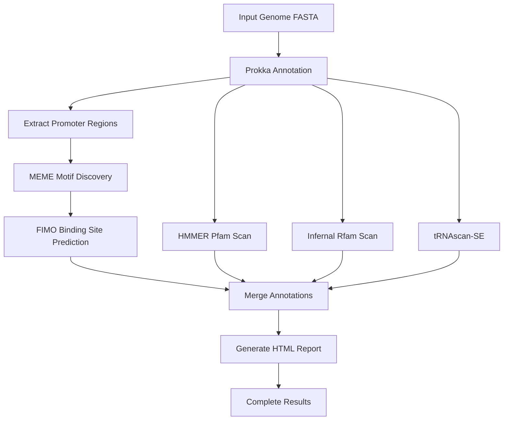

# 🧬 Prokaryotic Genome Regulatory Annotation Pipeline

[](https://opensource.org/licenses/MIT)
[](https://www.python.org/downloads/)
[](https://docs.conda.io/en/latest/)
[](https://github.com/yourusername/prokaryotic-pipeline/graphs/commit-activity)

> A fully automated bioinformatics pipeline for comprehensive prokaryotic genome annotation and regulatory element discovery

## 📋 Overview

This pipeline provides an end-to-end solution for annotating bacterial genomes and discovering regulatory elements including promoters, transcription factor binding sites, and functional RNA elements. Simply provide your genome sequences, and the pipeline handles everything from gene prediction to regulatory motif discovery and generates comprehensive HTML reports.

---

## ✨ Features

- 🔄 **Fully Automated** - Process multiple genomes sequentially without manual intervention
- 🧬 **Comprehensive Annotation** - CDS, tRNA, rRNA, and ncRNA detection
- 🎯 **Regulatory Element Discovery** - Identifies promoters and transcription factor binding sites
- 📊 **Interactive Reports** - Beautiful HTML reports with visualization of results
- 🗂️ **Structured Outputs** - GFF files with merged gene and regulatory annotations
- 🛠️ **Easy Setup** - One-script installation with conda environment management
- 💾 **Database Integration** - Automatic Pfam and Rfam database downloads
- 📦 **Production Ready** - Tested on Ubuntu, Debian, and CentOS systems

---

## 🚀 Quick Start

```bash
# 1. Download the setup script
wget https://raw.githubusercontent.com/yourusername/prokaryotic-pipeline/main/setup_environment.sh
chmod +x setup_environment.sh

# 2. Run initial setup
./setup_environment.sh

# 3. Add environment.yml to ~/genomics_pipeline/ (script will pause and wait)

# 4. Run setup again to complete installation
./setup_environment.sh

# 5. Add your genome files to genomes_to_process/
cp your_genome.fna ~/genomics_pipeline/genomes_to_process/

# 6. Run the pipeline
cd ~/genomics_pipeline
./run_automated_pipeline.sh
```

---

## 📦 Installation

### Prerequisites

- **Operating System**: Linux (Ubuntu 18.04+, Debian 10+, CentOS 7+)
- **Package Manager**: Conda or Miniconda ([Install here](https://docs.conda.io/en/latest/miniconda.html))
- **Memory**: Minimum 8GB RAM (16GB recommended)
- **Storage**: ~10GB for databases and dependencies
- **Internet**: Required for database downloads during setup

### Step-by-Step Installation

#### Step 1: Download Setup Script

```bash
cd ~
wget https://raw.githubusercontent.com/yourusername/prokaryotic-pipeline/main/setup_environment.sh
chmod +x setup_environment.sh
```

#### Step 2: Initial Setup Run

```bash
./setup_environment.sh
```

The script will:
- Create the `~/genomics_pipeline/` directory structure
- Pause and prompt you to add `environment.yml`

#### Step 3: Add Environment Configuration

```bash
# Download or copy environment.yml to the pipeline directory
wget -P ~/genomics_pipeline/ https://raw.githubusercontent.com/yourusername/prokaryotic-pipeline/main/environment.yml
```

#### Step 4: Complete Installation

```bash
./setup_environment.sh
```

The script will now:
- Create the conda environment with all dependencies
- Install bioinformatics tools (Prokka, MEME Suite, HMMER, etc.)
- Download Pfam and Rfam databases (~8GB)
- Verify all installations

> **⏱️ Note**: Installation typically takes 20-40 minutes depending on internet speed.

---

## 📁 Repository Structure

```
prokaryotic-pipeline/
├── setup_environment.sh           # Initial setup and environment configuration
├── environment.yml                # Conda environment specification
├── run_automated_pipeline.sh      # Main pipeline execution script
├── generate_single_report.py      # HTML report generator
├── README.md                      # This file
├── LICENSE                        # MIT License
└── examples/                      # Example genomes and outputs
    ├── sample_genome.fna
    └── sample_output/
```

### Directory Structure (Created by Setup)

```
~/genomics_pipeline/
├── genomes_to_process/           # Input: Place your genome files here
├── results/                       # Output: All pipeline results
│   └── [genome_name]/
│       ├── annotation/            # Prokka annotations
│       ├── promoters/             # Regulatory element predictions
│       ├── motifs/                # MEME motif discovery
│       ├── fimo/                  # FIMO binding site predictions
│       ├── merged/                # Combined annotations (GFF)
│       └── report.html            # Interactive HTML report
├── databases/                     # Pfam and Rfam databases
├── logs/                          # Pipeline execution logs
└── scripts/                       # Pipeline scripts
```

---

## 🔧 Tools & Databases

### Bioinformatics Tools

| Tool | Version | Purpose |
|------|---------|---------|
| **Prokka** | 1.14+ | Gene annotation |
| **MEME Suite** | 5.4+ | Motif discovery |
| **FIMO** | 5.4+ | Motif scanning |
| **HMMER** | 3.3+ | Protein domain detection |
| **Infernal** | 1.1+ | ncRNA detection |
| **tRNAscan-SE** | 2.0+ | tRNA gene prediction |
| **bedtools** | 2.30+ | Genomic interval operations |
| **samtools** | 1.15+ | Sequence file processing |

### Databases

- **Pfam** (v35.0): Protein family database for domain annotation
- **Rfam** (v14.9): RNA family database for ncRNA detection

---

## 💻 Usage

### Basic Usage

1. **Activate the environment**:
```bash
conda activate genomics_pipeline
```

2. **Add genome files** to `genomes_to_process/`:
```bash
cp /path/to/your/genome.fna ~/genomics_pipeline/genomes_to_process/
```

> **📌 Supported Formats**: `.fna`, `.fa`, `.fasta`

3. **Run the pipeline**:
```bash
cd ~/genomics_pipeline
./run_automated_pipeline.sh
```

### Processing Multiple Genomes

The pipeline automatically processes all genome files in `genomes_to_process/`:

```bash
# Add multiple genomes
cp genome1.fna genome2.fna genome3.fna ~/genomics_pipeline/genomes_to_process/

# Run pipeline - processes all genomes sequentially
./run_automated_pipeline.sh
```

### Command-Line Options

```bash
# Run with custom settings (edit script variables)
nano run_automated_pipeline.sh

# Key configurable parameters:
# - THREADS: Number of CPU threads (default: 4)
# - MEME_NMOTIFS: Number of motifs to discover (default: 10-15)
# - PROMOTER_UPSTREAM: Promoter region size (default: 500bp)
```

---

## 📊 Output Files

### Per-Genome Results

Each processed genome generates the following outputs in `results/[genome_name]/`:

#### 1. Annotation Files (`annotation/`)
- `genome.gff` - Gene coordinates and features
- `genome.gbk` - GenBank format annotation
- `genome.faa` - Protein sequences
- `genome.ffn` - Gene nucleotide sequences
- `genome.tsv` - Tab-delimited annotation table

#### 2. Regulatory Elements (`promoters/`)
- `promoter_regions.fasta` - Extracted upstream sequences
- `motif_summary.tsv` - Discovered motifs with statistics

#### 3. Motif Discovery (`motifs/`)
- `meme.html` - MEME motif discovery report
- `meme.txt` - Motif position weight matrices
- `logo_*.png` - Sequence logo images for each motif

#### 4. Binding Sites (`fimo/`)
- `fimo.tsv` - All predicted transcription factor binding sites
- `fimo.gff` - Binding sites in GFF format
- `fimo.html` - Interactive FIMO report

#### 5. Merged Annotations (`merged/`)
- `complete_annotation.gff` - Genes + regulatory elements combined
- `annotation_statistics.txt` - Summary statistics

#### 6. Interactive Report
- `report.html` - Comprehensive HTML report with:
  - Genome statistics
  - Annotation summary tables
  - Motif visualizations
  - Regulatory element distribution
  - Interactive gene/feature browser

### Example Output Statistics

| Feature Type | Typical Count |
|--------------|---------------|
| Protein-coding genes | 3,000 - 5,000 |
| tRNA genes | 40 - 80 |
| rRNA genes | 3 - 15 |
| ncRNA genes | 50 - 200 |
| Regulatory motifs | 10 - 15 |
| TF binding sites | 100 - 500 |

---

## 🔍 Pipeline Workflow



### Detailed Steps

1. **Gene Annotation** - Prokka identifies coding sequences, rRNAs, and tRNAs
2. **Promoter Extraction** - Extract upstream regions (default: 500bp) from all genes
3. **Motif Discovery** - MEME discovers overrepresented sequence motifs
4. **Binding Site Prediction** - FIMO scans genome for motif occurrences
5. **Domain Annotation** - HMMER identifies protein domains using Pfam
6. **ncRNA Detection** - Infernal finds structural RNAs using Rfam
7. **tRNA Refinement** - tRNAscan-SE provides detailed tRNA predictions
8. **Annotation Merging** - Combine all features into unified GFF file
9. **Report Generation** - Create interactive HTML visualization

---

## 🛠️ Troubleshooting

### Common Issues

#### Issue: "Conda command not found"

```bash
# Install Miniconda
wget https://repo.anaconda.com/miniconda/Miniconda3-latest-Linux-x86_64.sh
bash Miniconda3-latest-Linux-x86_64.sh
source ~/.bashrc
```

#### Issue: "Database download failed"

```bash
# Manually download databases
cd ~/genomics_pipeline/databases

# Pfam
wget ftp://ftp.ebi.ac.uk/pub/databases/Pfam/current_release/Pfam-A.hmm.gz
gunzip Pfam-A.hmm.gz
hmmpress Pfam-A.hmm

# Rfam
wget ftp://ftp.ebi.ac.uk/pub/databases/Rfam/CURRENT/Rfam.cm.gz
gunzip Rfam.cm.gz
cmpress Rfam.cm
```

#### Issue: "Out of memory error"

Reduce the number of threads or process genomes one at a time:

```bash
# Edit run_automated_pipeline.sh
THREADS=2  # Reduce from default 4
```

#### Issue: "Prokka annotation failed"

Check genome file format:

```bash
# Genome should have proper FASTA format
head -n 5 your_genome.fna

# Should look like:
# >contig_1
# ATCGATCGATCG...
```

#### Issue: "No motifs discovered"

This can occur with small genomes or low promoter diversity:

```bash
# Adjust MEME parameters in run_automated_pipeline.sh
MEME_NMOTIFS=5  # Reduce expected motifs
MEME_MINW=6     # Allow shorter motifs
```

### Log Files

Check pipeline logs for detailed error messages:

```bash
# View latest log
cat ~/genomics_pipeline/logs/pipeline_$(date +%Y%m%d).log

# Search for errors
grep -i error ~/genomics_pipeline/logs/*.log
```

### Getting Help

- 📖 **Documentation**: Check the [Wiki](https://github.com/yourusername/prokaryotic-pipeline/wiki)
- 🐛 **Bug Reports**: [Open an issue](https://github.com/yourusername/prokaryotic-pipeline/issues)
- 💬 **Discussions**: [Q&A Forum](https://github.com/yourusername/prokaryotic-pipeline/discussions)

---

## 📚 Citation

If you use this pipeline in your research, please cite:

```bibtex
@software{prokaryotic_pipeline,
  author = {Your Name},
  title = {Prokaryotic Genome Regulatory Annotation Pipeline},
  year = {2024},
  url = {https://github.com/yourusername/prokaryotic-pipeline}
}
```

### Tool Citations

Please also cite the underlying tools:

- **Prokka**: Seemann T. (2014) *Bioinformatics* 30(14):2068-9
- **MEME Suite**: Bailey TL et al. (2015) *Nucleic Acids Res.* 43(W1):W39-49
- **HMMER**: Eddy SR (2011) *PLoS Comput Biol* 7(10):e1002195
- **Infernal**: Nawrocki EP & Eddy SR (2013) *Bioinformatics* 29(22):2933-5

---

## 🤝 Contributing

Contributions are welcome! Please follow these steps:

1. Fork the repository
2. Create a feature branch (`git checkout -b feature/AmazingFeature`)
3. Commit your changes (`git commit -m 'Add some AmazingFeature'`)
4. Push to the branch (`git push origin feature/AmazingFeature`)
5. Open a Pull Request

### Development Setup

```bash
# Clone the repository
git clone https://github.com/yourusername/prokaryotic-pipeline.git
cd prokaryotic-pipeline

# Create development environment
conda env create -f environment.yml
conda activate genomics_pipeline

# Run tests (if available)
pytest tests/
```

---

## 📄 License

This project is licensed under the MIT License - see the [LICENSE](LICENSE) file for details.

---

## 🙏 Acknowledgments

- Prokka developers for excellent genome annotation tools
- MEME Suite team for motif discovery algorithms
- Pfam and Rfam database maintainers
- All contributors and users of this pipeline

---

## 📞 Contact

- **Author**: Your Name
- **Email**: your.email@example.com
- **GitHub**: [@yourusername](https://github.com/yourusername)
- **Lab Website**: https://yourlab.edu

---

## 🗺️ Roadmap

- [ ] Add support for eukaryotic genome annotation
- [ ] Implement parallel processing for multiple genomes
- [ ] Add comparative genomics features
- [ ] Web interface for pipeline execution
- [ ] Docker containerization
- [ ] Nextflow/Snakemake workflow implementation

---

## ⭐ Star History

If you find this pipeline useful, please consider giving it a star! ⭐

[](https://star-history.com/#yourusername/prokaryotic-pipeline&Date)

---

**Made with ❤️ for the bioinformatics community**
