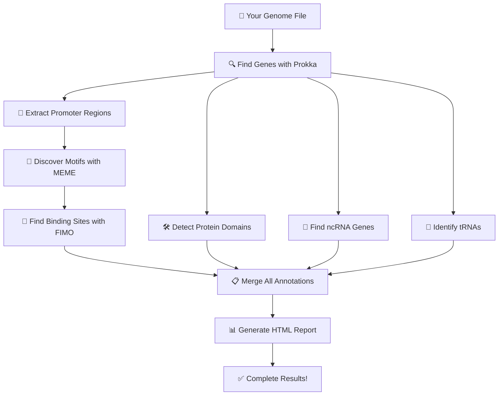

# 🧬 Prokaryotic Genome Annotation Pipeline

[](https://opensource.org/licenses/MIT)
[](https://www.python.org/downloads/)
[](https://docs.conda.io/en/latest/)

> 🚀 **Automated pipeline to annotate bacterial genomes and discover regulatory elements**

Simply add your genome files and run! The pipeline does everything automatically and generates beautiful HTML reports.

---

## ✨ What Does This Pipeline Do?

- 🧬 **Finds all genes** in your bacterial genome (protein-coding, tRNA, rRNA)
- 🎯 **Discovers regulatory elements** (promoters, transcription factor binding sites)
- 📊 **Creates interactive HTML reports** with beautiful visualizations
- 🗂️ **Organizes all results** in easy-to-use formats (GFF, FASTA, tables)
- ⚡ **100% automated** - just add genome files and run one command!

---

## 🎬 Quick Start (3 Steps!)

### Step 1: Download and Setup

```bash
# Download the setup script
https://github.com/Bharat-Genome-Database-BGDB/CoGe_Pipeline/blob/main/group%207/setup_environment.sh
chmod +x setup_environment.sh

# Run it
./setup_environment.sh
```

The script will pause and ask you to add `environment.yml` file.

### Step 2: Add Environment File

```bash
cd ~/genomics_pipeline

# Download environment.yml to the pipeline folder
https://github.com/Bharat-Genome-Database-BGDB/CoGe_Pipeline/blob/main/group%207/environment.yml
# Run setup again to install everything
./setup_environment.sh
```

⏱️ **Installation takes 20-40 minutes** (downloads databases and tools)

### Step 3: Run the Pipeline

```bash
# Add your genome file
cp your_genome.fna ~/genomics_pipeline/genomes_to_process/

# Go to pipeline folder
cd ~/genomics_pipeline
```

### Step 4: Add MAIN script File
```bash
# Add the main_automated script
https://github.com/Bharat-Genome-Database-BGDB/CoGe_Pipeline/blob/main/group%207/run_automated.sh

# add python script
https://github.com/Bharat-Genome-Database-BGDB/CoGe_Pipeline/blob/main/group%207/generate_single_report.py

chmod +x run_automated-pipeline.sh

# Run it!
./run_automated_pipeline.sh
```

That's it! 🎉 Check the `results/` folder for your outputs.

---

## 📋 What You Need Before Starting

- **Computer**: Linux system (Ubuntu, Debian, or CentOS)
- **Software**: Conda or Miniconda ([Download here](https://docs.conda.io/en/latest/miniconda.html))
- **Memory**: At least 8GB RAM
- **Storage**: About 10GB free space
- **Internet**: Needed for setup (downloads databases)

> 💡 **Don't have Linux?** You can use Windows Subsystem for Linux (WSL) or a Linux virtual machine.

---

## 📁 Folder Structure

After setup, you'll have this structure:

```
~/genomics_pipeline/
│
├── genomes_to_process/        👈 PUT YOUR GENOME FILES HERE
│
├── results/                   👈 YOUR RESULTS APPEAR HERE
│   └── [genome_name]/
│       ├── annotation/        (genes, proteins)
│       ├── motifs/           (discovered patterns)
│       ├── fimo/             (binding sites)
│       └── report.html       📊 INTERACTIVE REPORT
│
├── data/
│   └── [dbs]                (Pfam, Rfam - auto-downloaded)
├── logs/                      (pipeline logs)
└── scripts/                   (pipeline scripts)
```

---

## 🔄 How the Pipeline Works



---

## 📊 What You'll Get

### For Each Genome, You Get:

| Output | Description | File Location |
|--------|-------------|---------------|
| 📊 **Interactive Report** | Beautiful HTML with all results | `report.html` |
| 🧬 **Gene Annotations** | All genes with coordinates | `annotation/genome.gff` |
| 🧪 **Protein Sequences** | All predicted proteins | `annotation/genome.faa` |
| 🎯 **Regulatory Motifs** | 10-15 discovered patterns | `motifs/meme.html` |
| 📍 **Binding Sites** | 100-500 predicted sites | `fimo/fimo.tsv` |
| 📋 **Complete GFF** | Genes + regulatory elements | `merged/complete_annotation.gff` |

### Typical Results:

- **Genes Found**: 3,000 - 5,000
- **tRNAs**: 40 - 80
- **Regulatory Motifs**: 10 - 15
- **Binding Sites**: 100 - 500

---

## 🔧 Tools Used (Installed Automatically)

- **Prokka** - Finds genes in your genome
- **MEME Suite** - Discovers regulatory patterns
- **FIMO** - Locates transcription factor binding sites
- **HMMER** - Identifies protein domains
- **Infernal** - Finds RNA genes
- **tRNAscan-SE** - Detects tRNA genes

Plus databases: Pfam (proteins) and Rfam (RNAs)

---

## 💻 Processing Multiple Genomes

Want to process multiple genomes? Just add them all!

```bash
# Copy all your genome files
cp genome1.fna genome2.fna genome3.fna ~/genomics_pipeline/genomes_to_process/

# Run pipeline once - it processes all genomes automatically
./run_automated_pipeline.sh
```

Each genome gets its own results folder! 📁

---

## ❓ Common Issues & Solutions

### "Conda command not found"

Install Miniconda first:
```bash
wget https://repo.anaconda.com/miniconda/Miniconda3-latest-Linux-x86_64.sh
bash Miniconda3-latest-Linux-x86_64.sh
source ~/.bashrc
```

### "Out of memory"

Your genome might be too large. Edit the script to use fewer threads:
```bash
nano run_automated_pipeline.sh
# Change: THREADS=4 to THREADS=2
```

### "Pipeline failed"

Check the log files:
```bash
cat ~/genomics_pipeline/logs/pipeline_*.log
```

### Need Help?

- 🐛 [Report a bug](https://github.com/yourusername/prokaryotic-pipeline/issues)
- 💬 [Ask a question](https://github.com/yourusername/prokaryotic-pipeline/discussions)

---

## 📖 Example Usage

```bash
# Activate environment (if not already active)
conda activate genomics_pipeline

# Add your genome
cp /path/to/ecoli.fna ~/genomics_pipeline/genomes_to_process/

# Run pipeline
cd ~/genomics_pipeline
./run_automated_pipeline.sh

# View results
firefox ~/genomics_pipeline/results/ecoli/report.html
```
---

## 🤝 Contributing

Want to improve this pipeline? Contributions are welcome!

1. Fork the repository
2. Make your changes
3. Submit a pull request

---

## ⭐ Like This Pipeline?

If you find this useful, please give it a star on GitHub! ⭐

---

**for bioinformatics beginners and experts**
