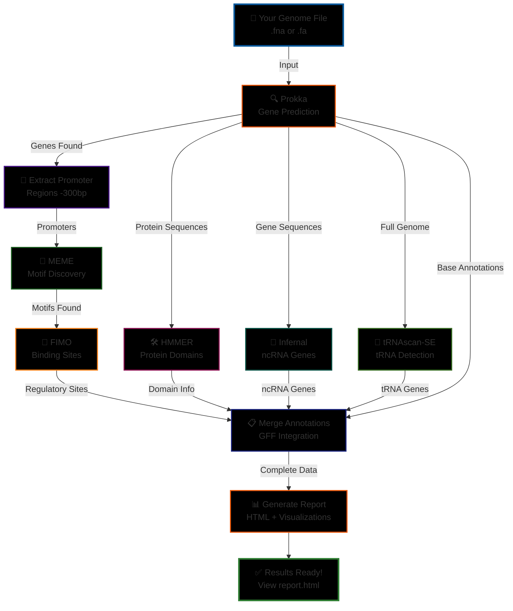

# 🧬 Prokaryotic Genome Annotation Pipeline

<div align="center">

[](https://opensource.org/licenses/MIT)
[](https://www.python.org/downloads/)
[](https://docs.conda.io/en/latest/)

**🚀 Automated pipeline to annotate bacterial genomes and discover regulatory elements**

*Simply add your genome files and run! The pipeline does everything automatically and generates beautiful HTML reports.*

[Quick Start](#-quick-start-step-by-step) • [Features](#-what-does-this-pipeline-do) • [Documentation](#-how-the-pipeline-works) • [Troubleshooting](#-common-issues--solutions)

</div>

---

## ✨ What Does This Pipeline Do?

<table>
<tr>
<td width="50%">

### 🔬 **Gene Discovery**
- Identifies all protein-coding genes
- Detects tRNA genes (40-80 per genome)
- Finds rRNA genes
- Annotates gene functions

</td>
<td width="50%">

### 🎯 **Regulatory Analysis**
- Discovers promoter regions
- Identifies transcription factor binding sites
- Finds DNA motifs (10-15 patterns)
- Maps regulatory elements

</td>
</tr>
<tr>
<td width="50%">

### 📊 **Rich Outputs**
- Interactive HTML reports
- GFF annotation files
- FASTA sequences
- Statistical summaries

</td>
<td width="50%">

### ⚡ **100% Automated**
- One-command execution
- Batch processing support
- Organized file structure
- Detailed logging

</td>
</tr>
</table>

---

## 🎬 Quick Start (Step-by-Step)

> 💡 **First time user?** Don't worry! Just follow these steps carefully, and you'll be annotating genomes in no time.

### 📦 **Step 1: Download Setup Script**

```bash
# Download the setup_environment.sh file from GitHub
# Visit: https://github.com/Bharat-Genome-Database-BGDB/CoGe_Pipeline/blob/main/group%207/setup_environment.sh
# Click 'Raw' button, then right-click and 'Save As' to download

# Make it executable
chmod +x setup_environment.sh
```

### 🚀 **Step 2: Run Setup (First Time)**

```bash
# Run the setup script
./setup_environment.sh
```

> ⚠️ **Important:** The script will create a folder structure and then **PAUSE**. Don't worry, this is expected!

**You should see:**
```
✅ Created folder: ~/genomics_pipeline/genomes_to_process
✅ Created folder: ~/genomics_pipeline/data
✅ Created folder: ~/genomics_pipeline/results
✅ Created folder: ~/genomics_pipeline/logs

⏸️  PAUSED: Please add environment.yml file now!
```

### 📥 **Step 3: Download and Add Environment File**

```bash
# Download environment.yml from GitHub
# Visit: https://github.com/Bharat-Genome-Database-BGDB/CoGe_Pipeline/blob/main/group%207/environment.yml
# Click 'Raw' button, then right-click and 'Save As' to download

# Copy it to the genomics_pipeline folder
cp environment.yml ~/genomics_pipeline/

# Verify it's there
ls ~/genomics_pipeline/environment.yml
```

### 🔄 **Step 4: Complete Setup**

```bash
# Go back to where setup_environment.sh is located
cd ..  # (or cd to wherever you saved setup_environment.sh)

# Run setup again to complete installation
./setup_environment.sh
```

> ⏱️ **This will take 20-40 minutes** - The script is downloading databases (Pfam, Rfam) and installing tools. Go grab a coffee! ☕

**You'll see messages like:**
```
📦 Installing conda environment...
📚 Downloading Pfam database...
📚 Downloading Rfam database...
✅ Setup complete!
```

### 📜 **Step 5: Download Pipeline Scripts**

```bash
# Navigate to the genomics_pipeline folder
cd ~/genomics_pipeline

# Download the main pipeline script
# Visit: https://github.com/Bharat-Genome-Database-BGDB/CoGe_Pipeline/blob/main/group%207/run_automated.sh
# Download and copy to ~/genomics_pipeline/

# Download the Python report generator
# Visit: https://github.com/Bharat-Genome-Database-BGDB/CoGe_Pipeline/blob/main/group%207/generate_single_report.py
# Download and copy to ~/genomics_pipeline/

# Make the main script executable
chmod +x run_automated.sh
```

**Your folder should now look like this:**
```
~/genomics_pipeline/
├── run_automated.sh          ✅ Main pipeline script
├── generate_single_report.py ✅ Report generator
├── environment.yml           ✅ Conda environment
├── genomes_to_process/       📁 (empty - add genomes here)
├── data/                     📁 (databases)
├── results/                  📁 (results appear here)
└── logs/                     📁 (log files)
```

### 🧬 **Step 6: Add Your Genome File**

```bash
# Download your genome file (.fna or .fa format)
# Then copy it to genomes_to_process folder

cp your_genome.fna ~/genomics_pipeline/genomes_to_process/

# OR if you have multiple genomes:
cp genome1.fna genome2.fna genome3.fna ~/genomics_pipeline/genomes_to_process/
```

> 📝 **Supported formats:** `.fna`, `.fa`, `.fasta`

### ▶️ **Step 7: Run the Pipeline!**

```bash
# Make sure you're in the genomics_pipeline folder
cd ~/genomics_pipeline

# Activate the conda environment
conda activate genomics_pipeline

# Run the pipeline!
./run_automated.sh
```

### 🎉 **Step 8: View Your Results**

```bash
# Check the results folder
ls ~/genomics_pipeline/results/

# Open the HTML report in your browser
firefox ~/genomics_pipeline/results/your_genome/report.html

# OR use any browser:
google-chrome ~/genomics_pipeline/results/your_genome/report.html
```

**That's it!** Your genome is now fully annotated! 🎊

---

## 📋 What You Need Before Starting

<table>
<tr>
<td width="25%" align="center">

### 💻 **Operating System**
Linux system<br>
(Ubuntu, Debian, CentOS)

</td>
<td width="25%" align="center">

### 📦 **Software**
Conda or Miniconda<br>
[Download here](https://docs.conda.io/en/latest/miniconda.html)

</td>
<td width="25%" align="center">

### 🧠 **Memory**
At least 8GB RAM<br>
(16GB recommended)

</td>
<td width="25%" align="center">

### 💾 **Storage**
~10GB free space<br>
(for databases)

</td>
</tr>
</table>

> 💡 **Don't have Linux?** 
> - Windows users: Install [WSL (Windows Subsystem for Linux)](https://docs.microsoft.com/en-us/windows/wsl/install)
> - Mac users: Most Mac systems are Unix-based and should work!
> - Alternative: Use a Linux virtual machine with VirtualBox

---

## 📁 Complete Folder Structure

After setup, your folder structure will look like this:

```
~/genomics_pipeline/
│
├── 📜 run_automated.sh              # Main pipeline script (you download this)
├── 📜 generate_single_report.py     # Report generator (you download this)
├── 📜 environment.yml               # Conda environment file (you download this)
│
├── 📁 genomes_to_process/           # 👈 PUT YOUR GENOME FILES HERE (.fna, .fa)
│   ├── genome1.fna
│   ├── genome2.fna
│   └── genome3.fna
│
├── 📁 results/                      # 👈 YOUR RESULTS APPEAR HERE
│   ├── genome1/
│   │   ├── annotation/              # Gene annotations
│   │   │   ├── genome1.gff          # Gene coordinates
│   │   │   ├── genome1.faa          # Protein sequences
│   │   │   ├── genome1.ffn          # Gene nucleotide sequences
│   │   │   └── genome1.gbk          # GenBank format
│   │   ├── motifs/                  # Discovered regulatory motifs
│   │   │   ├── meme.html            # MEME results (interactive)
│   │   │   └── meme.txt             # MEME text output
│   │   ├── fimo/                    # Transcription factor binding sites
│   │   │   ├── fimo.html            # FIMO results (interactive)
│   │   │   └── fimo.tsv             # Binding site coordinates
│   │   ├── merged/                  # Complete annotations
│   │   │   └── complete_annotation.gff  # Genes + regulatory elements
│   │   └── 📊 report.html           # ⭐ MAIN INTERACTIVE REPORT
│   │
│   ├── genome2/                     # Same structure for each genome
│   └── genome3/
│
├── 📁 data/                         # Auto-downloaded databases
│   ├── Pfam-A.hmm                   # Protein domain database
│   └── Rfam.cm                      # RNA family database
│
├── 📁 logs/                         # Pipeline execution logs
│   ├── pipeline_20240120_143022.log
│   └── pipeline_20240121_091544.log
│
└── 📁 scripts/                      # Internal pipeline scripts (auto-generated)
```

---

## 🔄 How the Pipeline Works


```mermaid
graph TB
    A[📄 Your Genome File<br/>.fna or .fa] -->|Input| B[🔍 Prokka<br/>Gene Prediction]
    
    B -->|Genes Found| C[🧬 Extract Promoter<br/>Regions -300bp]
    B -->|Protein Sequences| F[🛠️ HMMER<br/>Protein Domains]
    B -->|Gene Sequences| G[🧮 Infernal<br/>ncRNA Genes]
    B -->|Full Genome| H[🔬 tRNAscan-SE<br/>tRNA Detection]
    
    C -->|Promoters| D[🎯 MEME<br/>Motif Discovery]
    D -->|Motifs Found| E[📍 FIMO<br/>Binding Sites]
    
    E -->|Regulatory Sites| I[📋 Merge Annotations<br/>GFF Integration]
    F -->|Domain Info| I
    G -->|ncRNA Genes| I
    H -->|tRNA Genes| I
    B -->|Base Annotations| I
    
    I -->|Complete Data| J[📊 Generate Report<br/>HTML + Visualizations]
    J --> K[✅ Results Ready!<br/>View report.html]
    
    style A fill:#000000,stroke:#01579b,stroke-width:3px
    style B fill:#000000,stroke:#e65100,stroke-width:2px
    style C fill:#000000,stroke:#4a148c,stroke-width:2px
    style D fill:#000000,stroke:#1b5e20,stroke-width:2px
    style E fill:#000000,stroke:#f57f17,stroke-width:2px
    style F fill:#000000,stroke:#880e4f,stroke-width:2px
    style G fill:#000000,stroke:#004d40,stroke-width:2px
    style H fill:#000000,stroke:#33691e,stroke-width:2px
    style I fill:#000000,stroke:#1a237e,stroke-width:2px
    style J fill:#000000,stroke:#e65100,stroke-width:2px
    style K fill:#000000,stroke:#2e7d32,stroke-width:3px
```

---

## 📊 What You'll Get

### 🎯 For Each Genome, You Receive:

| Output Type | Description | Typical Count | File Location |
|-------------|-------------|---------------|---------------|
| 📊 **Interactive Report** | Beautiful HTML with all results and visualizations | 1 report | `report.html` |
| 🧬 **Gene Annotations** | All genes with coordinates and functions | 3,000-5,000 genes | `annotation/genome.gff` |
| 🧪 **Protein Sequences** | All predicted proteins in FASTA format | 3,000-5,000 proteins | `annotation/genome.faa` |
| 🧵 **Gene Sequences** | Nucleotide sequences of all genes | 3,000-5,000 genes | `annotation/genome.ffn` |
| 📖 **GenBank File** | Complete annotation in GenBank format | 1 file | `annotation/genome.gbk` |
| 🎯 **Regulatory Motifs** | Discovered DNA sequence patterns | 10-15 motifs | `motifs/meme.html` |
| 📍 **Binding Sites** | Predicted transcription factor binding sites | 100-500 sites | `fimo/fimo.tsv` |
| 📋 **Complete GFF** | Genes + regulatory elements merged | All features | `merged/complete_annotation.gff` |
| 🧬 **tRNA Genes** | Transfer RNA gene predictions | 40-80 tRNAs | Included in GFF |
| 🧮 **ncRNA Genes** | Non-coding RNA predictions | 20-50 ncRNAs | Included in GFF |

### 📈 Typical Results Summary:

<table>
<tr>
<td width="50%">

**Genetic Features:**
- 🧬 Protein-coding genes: 3,000 - 5,000
- 🔬 tRNA genes: 40 - 80
- 🧮 rRNA operons: 5 - 10
- 🧵 Other ncRNAs: 20 - 50

</td>
<td width="50%">

**Regulatory Elements:**
- 🎯 Unique motifs discovered: 10 - 15
- 📍 Binding sites predicted: 100 - 500
- 🧬 Promoter regions analyzed: 100s
- 🛠️ Protein domains identified: 1,000+

</td>
</tr>
</table>

---

## 🔧 Tools & Databases (All Installed Automatically)

### 🛠️ **Bioinformatics Tools:**

| Tool | Version | Purpose |
|------|---------|---------|
| **Prokka** | Latest | Rapid prokaryotic genome annotation |
| **MEME Suite** | 5.4+ | Motif discovery and analysis |
| **FIMO** | (MEME Suite) | Finding Individual Motif Occurrences |
| **HMMER** | 3.3+ | Protein domain identification |
| **Infernal** | 1.1+ | RNA homology searches |
| **tRNAscan-SE** | 2.0+ | tRNA gene detection |

### 📚 **Databases (Auto-Downloaded):**

- **Pfam**: Protein families and domains (~500MB)
- **Rfam**: RNA families (~200MB)

> 💾 **Total download size:** ~10GB (includes all tools and databases)

---

## 💻 Processing Multiple Genomes (Batch Mode)

The pipeline automatically processes **ALL** genomes in the `genomes_to_process/` folder!

```bash
# Add all your genome files at once
cp genome1.fna genome2.fna genome3.fna genome4.fna ~/genomics_pipeline/genomes_to_process/

# Run pipeline ONCE - it processes everything automatically!
cd ~/genomics_pipeline
conda activate genomics_pipeline
./run_automated.sh
```

**The pipeline will:**
1. ✅ Process each genome sequentially
2. ✅ Create separate results folders for each
3. ✅ Generate individual HTML reports
4. ✅ Log everything separately

**Each genome gets:**
```
results/
├── genome1/
│   └── report.html  📊
├── genome2/
│   └── report.html  📊
├── genome3/
│   └── report.html  📊
└── genome4/
    └── report.html  📊
```

---

## ❓ Common Issues & Solutions

<details>
<summary><b>🔴 "Conda command not found"</b></summary>

**Problem:** Conda/Miniconda is not installed.

**Solution:**
```bash
# Download Miniconda
wget https://repo.anaconda.com/miniconda/Miniconda3-latest-Linux-x86_64.sh

# Install it
bash Miniconda3-latest-Linux-x86_64.sh

# Follow the prompts, then reload your shell
source ~/.bashrc

# Verify installation
conda --version
```
</details>

<details>
<summary><b>🟡 "Out of memory" or pipeline crashes</b></summary>

**Problem:** Your system doesn't have enough RAM.

**Solution:** Reduce the number of threads used:
```bash
# Edit the pipeline script
nano ~/genomics_pipeline/run_automated.sh

# Find this line:
THREADS=8

# Change it to:
THREADS=2

# Save and exit (Ctrl+X, then Y, then Enter)
```
</details>

<details>
<summary><b>🟠 "Pipeline failed" or "Error in processing"</b></summary>

**Problem:** Something went wrong during execution.

**Solution:** Check the log files:
```bash
# View the latest log
ls -lt ~/genomics_pipeline/logs/
cat ~/genomics_pipeline/logs/pipeline_*.log | tail -50

# Look for ERROR or WARNING messages
```

Common causes:
- ❌ Genome file is corrupted or in wrong format
- ❌ Insufficient disk space
- ❌ Network issues during database download
</details>

<details>
<summary><b>🟢 "Environment activation failed"</b></summary>

**Problem:** Conda environment is not properly set up.

**Solution:**
```bash
# Re-run setup to fix the environment
cd [location of setup_environment.sh]
./setup_environment.sh

# OR manually create the environment
cd ~/genomics_pipeline
conda env create -f environment.yml

# Activate it
conda activate genomics_pipeline
```
</details>

<details>
<summary><b>🔵 "No genome files found"</b></summary>

**Problem:** Genome files are not in the correct location or format.

**Solution:**
```bash
# Check if files are in the right place
ls ~/genomics_pipeline/genomes_to_process/

# Ensure files have correct extension (.fna, .fa, .fasta)
# Rename if needed:
mv my_genome.txt my_genome.fna
```
</details>

<details>
<summary><b>🟣 "Database download failed"</b></summary>

**Problem:** Network issues or interrupted download.

**Solution:**
```bash
# Check internet connection
ping google.com

# Re-run setup to retry downloads
./setup_environment.sh

# OR manually download databases:
cd ~/genomics_pipeline/data
wget http://ftp.ebi.ac.uk/pub/databases/Pfam/current_release/Pfam-A.hmm.gz
gunzip Pfam-A.hmm.gz
hmmpress Pfam-A.hmm
```
</details>

---

## 📖 Example Complete Workflow

Here's a complete example from start to finish:

```bash
# ============================================
# STEP 1: Download and run initial setup
# ============================================
cd ~/Downloads
# (Download setup_environment.sh from GitHub)
chmod +x setup_environment.sh
./setup_environment.sh

# ============================================
# STEP 2: Add environment.yml
# ============================================
# (Download environment.yml from GitHub)
cp environment.yml ~/genomics_pipeline/

# ============================================
# STEP 3: Complete setup
# ============================================
./setup_environment.sh
# Wait 20-40 minutes for installation...

# ============================================
# STEP 4: Download pipeline scripts
# ============================================
cd ~/genomics_pipeline
# (Download run_automated.sh from GitHub)
# (Download generate_single_report.py from GitHub)
chmod +x run_automated.sh

# ============================================
# STEP 5: Add genome file
# ============================================
cp ~/Downloads/ecoli_k12.fna ~/genomics_pipeline/genomes_to_process/

# ============================================
# STEP 6: Run pipeline
# ============================================
conda activate genomics_pipeline
./run_automated.sh

# ============================================
# STEP 7: View results
# ============================================
firefox ~/genomics_pipeline/results/ecoli_k12/report.html
```

---

## 🤝 Contributing

We welcome contributions! Here's how:

1. 🍴 Fork the repository
2. 🌿 Create a feature branch (`git checkout -b feature/AmazingFeature`)
3. 💾 Commit your changes (`git commit -m 'Add some AmazingFeature'`)
4. 📤 Push to the branch (`git push origin feature/AmazingFeature`)
5. 🎯 Open a Pull Request

---

## 📝 Citation

If you use this pipeline in your research, please cite:

```bibtex
@software{prokaryotic_annotation_pipeline,
  title={Prokaryotic Genome Annotation Pipeline},
  author={Bharat Genome Database (BGDB)},
  year={2024},
  url={https://github.com/Bharat-Genome-Database-BGDB/CoGe_Pipeline}
}
```

---

## 📜 License

This project is licensed under the MIT License - see the [LICENSE](LICENSE) file for details.

---

## ⭐ Star This Repository!

If you find this pipeline useful, please give it a star! ⭐

**It helps others discover this tool and motivates us to keep improving it!**

---

<div align="center">

### 🧬 Built for Bioinformatics Beginners and Experts Alike 🧬

**Made with ❤️ by the Bharat Genome Database (BGDB) Team**

[⬆ Back to Top](#-prokaryotic-genome-annotation-pipeline)

</div>
